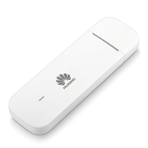

# Huawei E3372h-320 cli
 Control Huawei E3372h-320 (CL4E3372HM) from /bin/bash

[](https://github.com/vzakharchenko/E3372h-320-cli/actions/workflows/main.yml)




# Tested on
E3372h-320
version: 11.0.1.1(H697SP1C983)
Web UI version WEBUI 11.0.1.1(W13SP2C7201)


## Requirement
 - nodejs (>12)
## Installation
- install package
```
sudo npm i e3372h-320-cli -g
```

# Docker installation
TODO

## How to use

### Help

```
e3372h_320 --help
```
result:
```
e3372h_320 [command]

Commands:
  e3372h_320 sendSMS            send SMS to contact or group of contacts
  e3372h_320 contacts           get contact list with the latest sms messages
  e3372h_320 contactPages       contact list pages
  e3372h_320 sms                get contact SMS list
  e3372h_320 pages              count of sms pages
  e3372h_320 deleteSMS          delete sms by smsId
  e3372h_320 mobileData         Enable/Disable or Reconnect Mobile Data
  e3372h_320 monitoring         current Monitoring status

Options:
  --help     Show help                                                 [boolean]
  --version  Show version number                                       [boolean]
                                     [boolean]
```
### Version

```
e3372h_320 --version
```
result:
```
1.0.0
```

### Send SMS
- help
```
e3372h_320 sendSMS --help
```
result
```
e3372h_320 sendSMS

send SMS to contact or group of contacts

Positionals:
  url      huawei host                                  [default: "192.168.8.1"]
  phone    phones with ; as separator                                   [string]
  message  text message                                                 [string]

Options:
  --help     Show help                                                 [boolean]
  --version  Show version number                                       [boolean]
```

- Examples
Send message "Test message" to +11111111111
```
e3372h_320 sendSMS  --phone=+11111111111 --message="Test message"
```


### SMS Conversation API


result
- help
```
e3372h_320 contacts --help
```

```
e3372h_320 contacts

get contact list with the latest sms messages

Positionals:
  url           huawei host                             [default: "192.168.8.1"]
  page          sms page                                            [default: 1]
  exportFile    export to file                      [default: "./contacts.list"]
  exportFormat  export format (xml, json, none)                [default: "none"]

Options:
  --help     Show help                                                 [boolean]
  --version  Show version number                                       [boolean]
```

- Example get all contacts
```
e3372h_320 contacts
```
Result:
```
MessageId: 40004 Phone: +22222222222 lastMessage: {}
MessageId: 40005 Phone: +11111111111 lastMessage: "Test message"
```
- Example get all contacts and export as xml
```
./e3372h_320 contacts --exportFormat=xml --exportFile='./contacts.xml'
cat ./contacts.xml
```
Result:
```xml
<response>
<count>2</count>
<messages>

                <message>
                        <smstat>0</smstat>
                        <index>40004</index>
                        <phone>+222222222222</phone>
                        <content></content>
                        <date>2021-10-28 22:27:09</date>
                        <sca></sca>
                        <savetype>0</savetype>
                        <priority>0</priority>
                        <smstype>7</smstype>
                        <unreadcount>0</unreadcount>
                </message>
                <message>
                        <smstat>2</smstat>
                        <index>40005</index>
                        <phone>+11111111111</phone>
                        <content>Test message</content>
                        <date>2021-10-28 21:36:20</date>
                        <sca></sca>
                        <savetype>3</savetype>
                        <priority>4</priority>
                        <smstype>1</smstype>
                        <unreadcount>0</unreadcount>
                </message>
        </messages>
</response>
```

- Example get all contacts and export as json
```
e3372h_320 contacts --exportFormat=json --exportFile='./contacts.json'
cat ./contacts.json
```
Result:
```json
{
   "response":{
      "count":"2",
      "messages":{
         "message":[
            {
               "smstat":"0",
               "index":"40004",
               "phone":"+222222222222",
               "content":{

               },
               "date":"2021-10-28 22:27:09",
               "sca":{

               },
               "savetype":"0",
               "priority":"0",
               "smstype":"7",
               "unreadcount":"0"
            },
            {
               "smstat":"2",
               "index":"40005",
               "phone":"+11111111111",
               "content":"Test message",
               "date":"2021-10-28 21:36:20",
               "sca":{

               },
               "savetype":"3",
               "priority":"4",
               "smstype":"1",
               "unreadcount":"0"
            }
         ]
      }
   }
}
```

### SMS Contact Conversation API


- help
```
e3372h_320 sms --help
```
Result:
```
e3372h_320 sms

get contact SMS list

Positionals:
  url           huawei host                             [default: "192.168.8.1"]
  phone         contact phone number                                    [string]
  page          sms page                                            [default: 1]
  exportFile    export to file                           [default: "./sms.list"]
  exportFormat  export format (xml, json, none)                [default: "none"]
  deleteAfter   delete all messages after reading               [default: false]

Options:
  --help     Show help                                                 [boolean]
  --version  Show version number                                       [boolean]
```

- Example get conversation for phone +111111111111
```
e3372h_320 sms --phone=+111111111111
```
Result:
```
MessageId: 40001 Phone: +111111111111 Message: "test123"
MessageId: 40003 Phone: +111111111111 Message: "test123"
MessageId: 40000 Phone: +111111111111 Message: "Sms"
MessageId: 40002 Phone: +111111111111 Message: {}
MessageId: 40004 Phone: +111111111111 Message: {}

```
- Example get conversation for phone +111111111111 export result as xml
```
e3372h_320 sms  --exportFile=111111111111.xml --exportFormat=xml
cat ./111111111111.xml
```
Result:
```xml
<response>
<count>5</count>
<messages>
<message>
<smstat>3</smstat>
<index>40001</index>
<phone>+111111111111</phone>
<content>test123</content>
<date>2021-10-28 21:26:02</date>
<sca></sca>
<curbox>1</curbox>
<savetype>3</savetype>
<priority>4</priority>
<smstype>1</smstype>
</message>
<message>
<smstat>3</smstat>
<index>40003</index>
<phone>+111111111111</phone>
<content>test123</content>
<date>2021-10-28 21:27:06</date>
<sca></sca>
<curbox>1</curbox>
<savetype>3</savetype>
<priority>4</priority>
<smstype>1</smstype>
</message>
<message>
<smstat>1</smstat>
<index>40000</index>
<phone>+111111111111</phone>
<content>Sms</content>
<date>2021-10-28 21:58:39</date>
<sca></sca>
<curbox>0</curbox>
<savetype>0</savetype>
<priority>0</priority>
<smstype>1</smstype>
</message>
<message>
<smstat>1</smstat>
<index>40002</index>
<phone>+111111111111</phone>
<content></content>
<date>2021-10-28 22:26:05</date>
<sca></sca>
<curbox>0</curbox>
<savetype>0</savetype>
<priority>0</priority>
<smstype>7</smstype>
</message>
<message>
<smstat>1</smstat>
<index>40004</index>
<phone>+111111111111</phone>
<content></content>
<date>2021-10-28 22:27:09</date>
<sca></sca>
<curbox>0</curbox>
<savetype>0</savetype>
<priority>0</priority>
<smstype>7</smstype>
</message>
</messages>
</response>

```

- Example get all contacts and export as json
```
e3372h_320 sms  --exportFile=111111111111.json --exportFormat=json
cat ./111111111111.json
```
Result:
```json
{"response":{"count":"5","messages":{"message":[{"smstat":"3","index":"40001","phone":"+111111111111","content":"test123","date":"2021-10-28 21:26:02","sca":{},"curbox":"1","savetype":"3","priority":"4","smstype":"1"},{"smstat":"3","index":"40003","phone":"+111111111111","content":"test123","date":"2021-10-28 21:27:06","sca":{},"curbox":"1","savetype":"3","priority":"4","smstype":"1"},{"smstat":"1","index":"40000","phone":"+111111111111","content":"Sms","date":"2021-10-28 21:58:39","sca":{},"curbox":"0","savetype":"0","priority":"0","smstype":"1"},{"smstat":"1","index":"40002","phone":"+111111111111","content":{},"date":"2021-10-28 22:26:05","sca":{},"curbox":"0","savetype":"0","priority":"0","smstype":"7"},{"smstat":"1","index":"40004","phone":"+111111111111","content":{},"date":"2021-10-28 22:27:09","sca":{},"curbox":"0","savetype":"0","priority":"0","smstype":"7"}]}}}
```

### Delete sms message

- help
```
e3372h_320 deleteSMS --help
```

```
e3372h_320 deleteSMS

delete sms by smsId

Positionals:
  url        huawei host                                [default: "192.168.8.1"]
  messageId  messageId or index                                         [string]

Options:
  --help     Show help                                                 [boolean]
  --version  Show version number                                       [boolean]
```

- Example delete message
```
e3372h_320 deleteSMS  --messageId=40005
```

### mobileData

--help
```
e3372h_320 mobileData --help
```

```
e3372h_320 mobileData

Enable/Disable or Reconnect Mobile Data

Positionals:
  url   huawei host                                     [default: "192.168.8.1"]
  mode  change mobile data to on,off or reconnect

Options:
  --help     Show help                                                 [boolean]
  --version  Show version number                                       [boolean]
```


- Example disable mobile data
```
e3372h_320 mobileData --mode=on
```

- Example enable mobile data
```
e3372h_320 mobileData --mode=off
```
- Example reconnect
```
e3372h_320 mobileData --mode=reconnect
```

###  current Monitoring status

-help
```
 e3372h_320 monitoring  --help
```

```
e3372h_320 monitoring

current Monitoring status

Positionals:
  url           huawei host                             [default: "192.168.8.1"]
  exportFile    export to file                     [default: "./monitoring.log"]
  exportFormat  export format (xml, json, none)                [default: "none"]

Options:
  --help     Show help                                                 [boolean]
  --version  Show version number                                       [boolean]

```

- Example current status
```
e3372h_320 monitoring
```
```
ConnectionStatus=901
WifiConnectionStatus=[object Object]
SignalStrength=[object Object]
SignalIcon=4
CurrentNetworkType=19
CurrentServiceDomain=3
RoamingStatus=0
BatteryStatus=[object Object]
BatteryLevel=[object Object]
BatteryPercent=[object Object]
simlockStatus=0
PrimaryDns=195.38.164.15
SecondaryDns=195.38.164.16
wififrequence=0
flymode=0
PrimaryIPv6Dns=[object Object]
SecondaryIPv6Dns=[object Object]
CurrentWifiUser=[object Object]
TotalWifiUser=[object Object]
currenttotalwifiuser=0
ServiceStatus=2
SimStatus=1
WifiStatus=[object Object]
CurrentNetworkTypeEx=101
maxsignal=5
wifiindooronly=0
classify=hilink
usbup=0
wifiswitchstatus=0
WifiStatusExCustom=0
hvdcp_online=0
speedLimitStatus=0
poorSignalStatus=0
```

- Example current status export result as xml
```
e3372h_320 monitoring  --exportFile=status.xml --exportFormat=xml
cat ./status.xml
```
Result:
```xml
<?xml version="1.0" encoding="UTF-8"?>
<response>
<ConnectionStatus>901</ConnectionStatus>
<WifiConnectionStatus></WifiConnectionStatus>
<SignalStrength></SignalStrength>
<SignalIcon>3</SignalIcon>
<CurrentNetworkType>19</CurrentNetworkType>
<CurrentServiceDomain>3</CurrentServiceDomain>
<RoamingStatus>0</RoamingStatus>
<BatteryStatus></BatteryStatus>
<BatteryLevel></BatteryLevel>
<BatteryPercent></BatteryPercent>
<simlockStatus>0</simlockStatus>
<PrimaryDns>195.38.164.15</PrimaryDns>
<SecondaryDns>195.38.164.16</SecondaryDns>
<wififrequence>0</wififrequence>
<flymode>0</flymode>
<PrimaryIPv6Dns></PrimaryIPv6Dns>
<SecondaryIPv6Dns></SecondaryIPv6Dns>
<CurrentWifiUser></CurrentWifiUser>
<TotalWifiUser></TotalWifiUser>
<currenttotalwifiuser>0</currenttotalwifiuser>
<ServiceStatus>2</ServiceStatus>
<SimStatus>1</SimStatus>
<WifiStatus></WifiStatus>
<CurrentNetworkTypeEx>101</CurrentNetworkTypeEx>
<maxsignal>5</maxsignal>
<wifiindooronly>0</wifiindooronly>
<classify>hilink</classify>
<usbup>0</usbup>
<wifiswitchstatus>0</wifiswitchstatus>
<WifiStatusExCustom>0</WifiStatusExCustom>
<hvdcp_online>0</hvdcp_online>
<speedLimitStatus>0</speedLimitStatus>
<poorSignalStatus>0</poorSignalStatus>
</response>
```

- Example current status export result as json
```
e3372h_320 monitoring  --exportFile=status.json --exportFormat=json
cat ./status.json
```
Result:
```json
{"response":{"ConnectionStatus":"901","WifiConnectionStatus":{},"SignalStrength":{},"SignalIcon":"3","CurrentNetworkType":"19","CurrentServiceDomain":"3","RoamingStatus":"0","BatteryStatus":{},"BatteryLevel":{},"BatteryPercent":{},"simlockStatus":"0","PrimaryDns":"195.38.164.15","SecondaryDns":"195.38.164.16","wififrequence":"0","flymode":"0","PrimaryIPv6Dns":{},"SecondaryIPv6Dns":{},"CurrentWifiUser":{},"TotalWifiUser":{},"currenttotalwifiuser":"0","ServiceStatus":"2","SimStatus":"1","WifiStatus":{},"CurrentNetworkTypeEx":"101","maxsignal":"5","wifiindooronly":"0","classify":"hilink","usbup":"0","wifiswitchstatus":"0","WifiStatusExCustom":"0","hvdcp_online":"0","speedLimitStatus":"0","poorSignalStatus":"0"}}
```
